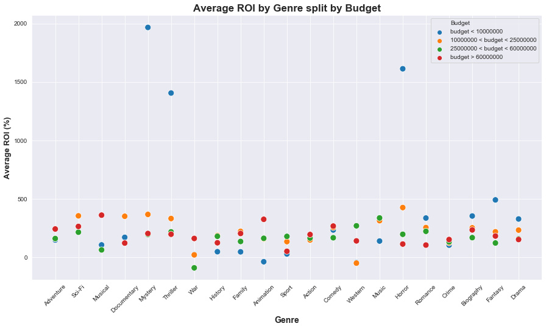

# Module 1 Final Project

## Introduction
***
This project is aimed at identifying the best road on which to join the film industry. The answers will come from cleaning, shaping and then analysing data against set questions and benchmarks. It will culminate in several recommendations for Microsoft. 

## Outline

This project follows the analysis of various datasets from Box Office Mojo, IMDB, Rotten Tomatoes, and TheMovieDB.org.

#### File Structure

1. student.ipynb 
    
    Contains the core code used to analyse the data and step-by-step description of what is being done. This code follows multiple avenues, some of which did not form part of the conclusion but rather showed the process of getting there. 
    
2. pitch_presentation

    Contains slides for a presentation on the main recommendations and findings from this project. 
    
3. zippedData

    Contains the data that was used for this project
    
4. movie_db.sqlite 

    This file is not present on the repository but if you load the first couple cells from the student jupyter notebook this file will be created. It is a SQL database containing all the data from the zippedData folder. 

#### Standardized Unit of Measurement

While working through the data, it was determined that comparing the films on different criteria at different times would lead to disparate results, essentially comparing apples to oranges. The following business statements were accepted as parameters of this research:

* The first of its kind for any development will incur specific sunk costs, such as hiring new staff, doing research into the field that is being entered, creating new business relationships, marketing, and a million other things. 
* A measurement of Gross return is largely irrelevant, it is the ratio of the revenue to the costs incurred that indicates financial success.

Based on the above, this research has focused on measuring success with Return on Investment (ROI). ROI calculates the relative return, meaning that it is a ratio of how much was invested to how much was made. This means that low budget movies (which often have the highest ROI's) will not be lost under blockbuster movies that cost a fortune to make.

Equation: (Total Revenue - Initial Investment) / Initial Investment

## Questions

1. Is there correlation between IMDb Ratings and Return on Investment?
    Should we be concerned with receiving critical acclaim?

2. Which Studio should we partner with?
    This question was calculated with consideration of both a studio's past success and its production numbers. 

3. Which Genre is the most likely to be profitable?
    This question was also set against different budget thresholds. 

## Findings

1. There was negligible correlation between IMDb Ratings ROI. The focus of this project should be the profits generated and the factors that lead to that rather than critical acclaim. 

2. Universal Studios proved to be the best potential studio partner, making solid returns across a large number of films.

3. With low budget films the answer is clearly Horror/Mystery/Thriller. They outperform everything else on the board by nearly 1000%. 
    It becomes less differentiated for higher budget productions. See the Graph below. 

## Recommendation

The highest ROI can be achieved by making low-budget Horror Mystery films, partner with Universal Studios. They perform well even in slightly higher budgets and there is no correlation with their critical reviews.